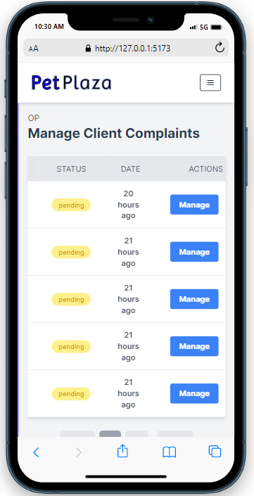
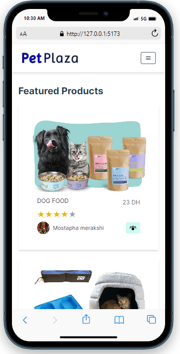
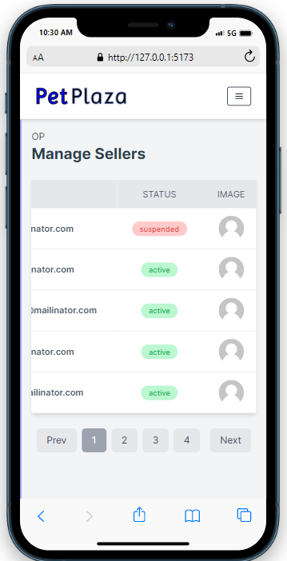

# PetsPlaza (End-User)

PetsPlza is  a mobile-friendly marketplace application for pet lovers, featuring distinct web portals
for sellers, buyers, admin, and quality control. Sellers can easily publish products, and manage orders, while clients
can discover preferred items through a recommendation algorithm

## List of features:


### Secure Authentication


### Seller Account Creation in 1min:


### Easy Order Placing 


### Customer Service and Compliant management, promoting high-quality service





### Featured and recommended Products based on mostly reached products



### Customer - Seller Chat window for real-time communication


### Admin portal - ensuring compliance - managing all aspects of the platform


### Seller profile - rating system put in place


### Seller Order Management


### Seller Dashboard


## Installation 

```sh
npm install
```

## Compile and Hot-Reload for Development

```sh
npm run dev
```

## Compile and Minify for Production

```sh
npm run build
```

## Run Unit Tests with [Vitest](https://vitest.dev/)

```sh
npm run test:unit
```
